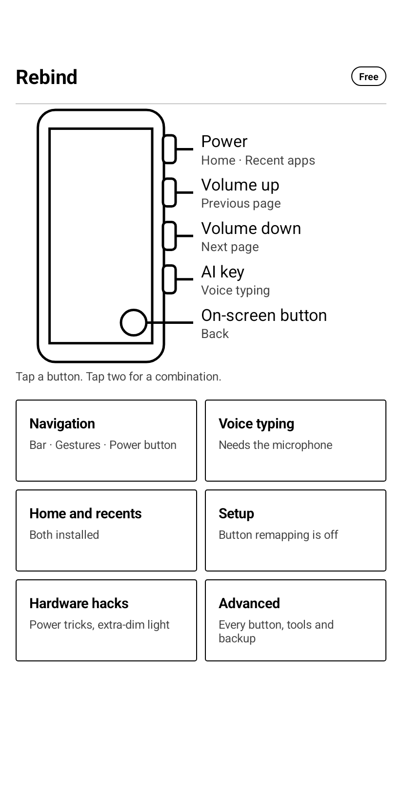
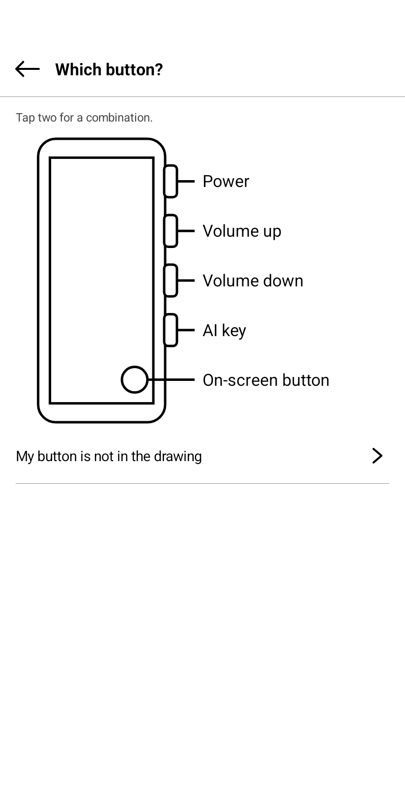
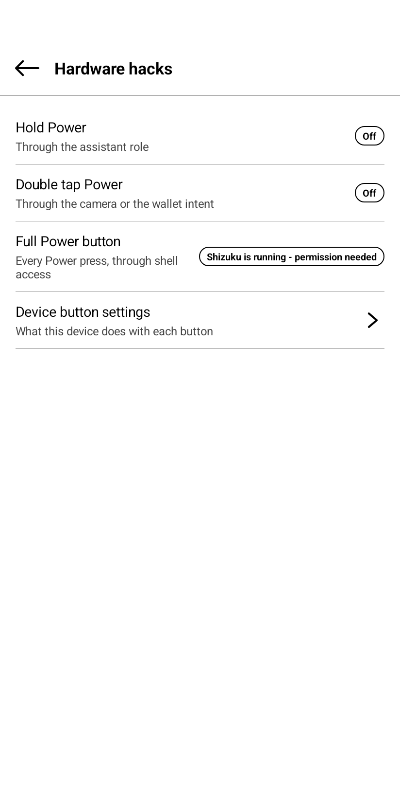
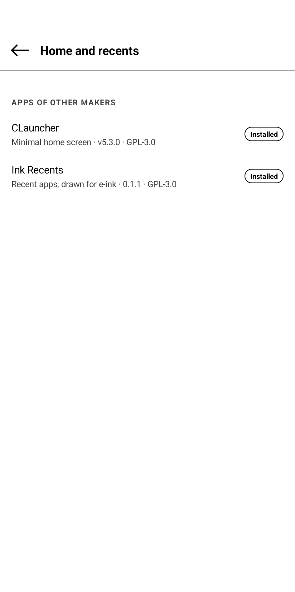

# Rebind: Button & Key Remap

Rebind remaps the hardware buttons of an Android 12+ device: volume keys, the
Power button, page-turn buttons, camera and assistant keys, and the AI key of
the Viwoods AiPaper. It is made for e-ink readers first, and it works on any
Android phone or tablet.

**Free beta.** Download the APK from
[Releases](https://github.com/equwal/rebind/releases). Everything works at no
charge while the beta is open. On a device with no Google Play, the app stays
free and complete after the beta too.

## Screenshots

  
  
  
  

The pictures are from a Viwoods AiPaper Reader.

## What it does

- Tap the button in a drawing of your device. Choose tap, double tap, triple
  tap or hold. Choose what it does. Rebind asks only for what that needs.
- Two buttons together make a combination.
- Actions: Back, Home, Recent apps, page turn (swipe or scroll), voice typing,
  lock screen, screenshot, open an app or a shortcut, media keys, brightness,
  a menu of actions, and more.
- The Power button: hold and double press work on any device. With
  [Shizuku](https://github.com/RikkaApps/Shizuku), every Power press works:
  tap, double tap, triple tap, hold.
- An on-screen button that floats over every app, for devices with few buttons.
- Recent apps made for e-ink: a button opens
  [Ink Recents](https://github.com/equwal/ink-recents), our free and open
  source recent-apps app. Cards with no glide, swipe up to close an app, swipe
  down to close all the others.
- Carries apps of other makers, not changed, and installs them when you ask:
  inkOS and ThinkLauncher (home screens made for e-ink, GPL-3.0), Ink Recents
  (GPL-3.0) and Whisper (speech to text on the device, MIT). Android asks you before each
  install. Rebind downloads nothing: it has no internet permission.
- Navigation in any mix of button bar, gestures and the Power button (needs
  Shizuku or an adb grant).
- Extra-dim frontlight below the lowest system level (needs Shizuku with root).
- Export and import of all settings as one JSON file.

No ads. No internet permission. Nothing is collected. See
[PRIVACY.md](PRIVACY.md).

## Extensions

Rebind puts other apps on a button. The list of extensions, with the intent
action of each one, is [Awesome Rebind](https://github.com/equwal/awesome-rebind).

## Install

1. Download `rebind-<version>-full.apk` from Releases and open it.
2. Open Rebind. Tap a button in the drawing and follow the steps.
3. If the accessibility switch turns itself off: App info > three-dot menu >
   Allow restricted settings. Android does this to every app that is not from
   a store.

Before you uninstall: if Rebind handles the Power button, turn that off first
(Advanced > Power button), so that the system settings go back as they were.

## Devices

| Device | State |
|---|---|
| Viwoods AiPaper Reader | Tested. Full profile, AI key included. |
| Any Android 12+ device | Generic profile. The app detects the buttons. |
| Onyx Boox | Wanted next. Please send a device report. |

Send a device report from Advanced > Device report. You see all of it before
it is sent, and you send it yourself.

## Say thanks

Rebind is free on every device that has no Google Play. If it made your
device better, you can [buy me a coffee](https://ko-fi.com/truex). A tip
unlocks nothing.

## Feedback

Open an [issue](https://github.com/equwal/rebind/issues). Say which device and
which firmware you have.

## Licence

Copyright (c) 2026 equwal. All rights reserved. The source code is not public.
This repository holds the releases, the changelog and the privacy policy.
